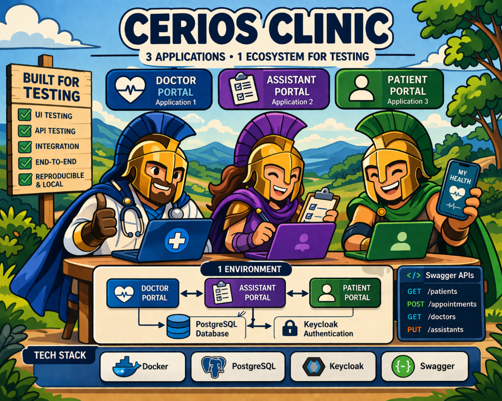

# Clinic Monorepo

This is a full-stack clinic management application. This guide gets you up and running with **Docker only** — no Node.js or other tools required.

> **Developers**: see [DEVELOPMENT.md](DEVELOPMENT.md) for the local development setup with hot-reload.

---

## What Is This Project?

| Service              | URL                       | Description                                                                         |
| -------------------- | ------------------------- | ----------------------------------------------------------------------------------- |
| **Patient Portal**   | http://localhost:5173     | React app — patients view/book appointments                                         |
| **Doctor Portal**    | http://localhost:5174     | React app — doctors manage their schedule                                           |
| **Assistant Portal** | http://localhost:5175     | React app — reception/admin staff manage appointments                               |
| **Admin Portal**     | http://localhost:5176     | React app — system administration                                                   |
| **Patient API**      | http://localhost:3001/api | NestJS backend for the Patient Portal ([Swagger](http://localhost:3001/api/docs))   |
| **Doctor API**       | http://localhost:3002/api | NestJS backend for the Doctor Portal ([Swagger](http://localhost:3002/api/docs))    |
| **Assistant API**    | http://localhost:3003/api | NestJS backend for the Assistant Portal ([Swagger](http://localhost:3003/api/docs)) |
| **Admin API**        | http://localhost:3004/api | NestJS backend for the Admin Portal ([Swagger](http://localhost:3004/api/docs))     |
| **Keycloak**         | http://localhost:8180     | Authentication & user management                                                    |
| **PostgreSQL**       | localhost:5432            | Database                                                                            |
| **Mailpit**          | http://localhost:8025     | Local email catcher (dev only)                                                      |

---

## Prerequisites

You only need **Docker Desktop** installed:

- **Docker Desktop** — https://www.docker.com/products/docker-desktop/
  - After installation, **restart your computer**.
  - Open Docker Desktop and wait until it shows **"Docker Desktop is running"**.
  - Windows Home users: Docker Desktop requires WSL 2. The installer will prompt you to enable it.

Verify it is working:

```bash
docker --version
docker compose version
```

---

## Quick Start (pre-built images — no clone needed)

**PowerShell (Windows):**

```powershell
New-Item -ItemType Directory -Force -Path C:\cerios-clinic | Set-Location
Invoke-WebRequest -Uri "https://raw.githubusercontent.com/CeriosTesting/cerios-clinic/main/infra/docker-compose.prebuilt.yml" -OutFile "docker-compose.yml"
docker compose --profile apps up -d --pull always
```

**Bash (macOS / Linux):**

```bash
mkdir -p ~/cerios-clinic && cd ~/cerios-clinic
curl -o docker-compose.yml https://raw.githubusercontent.com/CeriosTesting/cerios-clinic/main/infra/docker-compose.prebuilt.yml
docker compose --profile apps up -d --pull always
```

The first run downloads all images (may take a few minutes). Subsequent runs start in about 10 seconds.

### What happens automatically

1. PostgreSQL, Keycloak, and Mailpit start first.
2. Once they are healthy, the **db-init** container runs database migrations and seeds test data (then exits).
3. The four API servers start after db-init completes.
4. The four frontend portals start after the APIs are healthy.

### Check the status

```bash
docker ps
```

All containers should show `Up` or `healthy`. The `clinic-db-init` container will show `Exited (0)` — that is normal (it runs once and stops).

### Open the application

- **Patient Portal** → http://localhost:5173
- **Doctor Portal** → http://localhost:5174
- **Assistant Portal** → http://localhost:5175

---

## Test Accounts

### Doctors — log in at http://localhost:5174

| Email                      | Name             | Specialty           |
| -------------------------- | ---------------- | ------------------- |
| `admin@clinic.local`       | System Admin     | Doctor + Admin role |
| `dr.smith@clinic.local`    | James Smith      | General Practice    |
| `dr.johnson@clinic.local`  | Sarah Johnson    | Cardiology          |
| `dr.williams@clinic.local` | Michael Williams | Neurology           |

> `admin@clinic.local` uses password `Admin1234!` (from `KEYCLOAK_REALM_ADMIN_PASSWORD`).
> All other staff accounts use password `Clinic1234!` (from `SEED_STAFF_PASSWORD`).

### Assistants — log in at http://localhost:5175

| Email                           | Name         | Department      |
| ------------------------------- | ------------ | --------------- |
| `assistant.brown@clinic.local`  | Emily Brown  | Reception       |
| `assistant.davis@clinic.local`  | Robert Davis | Cardiology Wing |
| `assistant.miller@clinic.local` | Lisa Miller  | Neurology Wing  |

### Patients — log in at http://localhost:5173

| Email                          | Name           |
| ------------------------------ | -------------- |
| `patient.wilson@example.com`   | Alice Wilson   |
| `patient.moore@example.com`    | Bob Moore      |
| `patient.taylor@example.com`   | Carol Taylor   |
| `patient.anderson@example.com` | David Anderson |
| `patient.thomas@example.com`   | Eva Thomas     |

> Patient accounts use password `Patient1234!` (from `SEED_PATIENT_PASSWORD`).

---

## Swagger / API Documentation

| API           | Swagger URL                    |
| ------------- | ------------------------------ |
| Patient API   | http://localhost:3001/api/docs |
| Doctor API    | http://localhost:3002/api/docs |
| Assistant API | http://localhost:3003/api/docs |
| Admin API     | http://localhost:3004/api/docs |

---

## Keycloak Admin Console

1. Open http://localhost:8180
2. Click **Administration Console**
3. Log in with username `admin` / password `admin_secret`
4. Select the **clinic** realm from the dropdown in the top-left corner.

---

## Mailpit (Email Catcher)

All emails sent by the application are captured locally by Mailpit. No real emails are sent.

Open http://localhost:8025 to view the inbox.

---

## Docker Commands

| Command                                             | Description                                     |
| --------------------------------------------------- | ----------------------------------------------- |
| `docker compose --profile apps up -d --pull always` | Pull latest images and start everything         |
| `docker compose --profile apps up -d`               | Start everything (no image pull)                |
| `docker compose --profile apps down`                | Stop and remove all containers                  |
| `docker compose --profile apps down -v`             | Stop, remove containers **and delete all data** |
| `docker compose --profile apps logs -f`             | Stream logs from all services                   |
| `docker logs clinic-api-patient -f`                 | Stream logs from a specific container           |

> These commands assume you renamed the file to `docker-compose.yml`. If you kept the original name, add `-f docker-compose.prebuilt.yml` to each command.

### Resetting everything

To wipe all data (database, Keycloak users) and start fresh:

```bash
docker compose --profile apps down -v
docker compose --profile apps up -d --pull always
```

### After updating Keycloak realm configuration

Keycloak only imports `clinic-realm.json` when the realm does **not yet exist** in the database. If a new version of the images includes realm changes, a normal restart will **not** apply them. You need to wipe the data first:

```bash
docker compose --profile apps down -v
docker compose --profile apps up -d --pull always
```

---

## Troubleshooting

### "Cannot connect to Docker daemon"

Docker Desktop is not running. Open Docker Desktop from the Start Menu and wait for it to fully start before retrying.

### Keycloak never becomes healthy / stays "starting"

- Run `docker logs clinic-keycloak --tail 50` to see what is wrong.
- The most common cause is a timing issue. Run the `down` command and then `up` again and wait 2 minutes.

### A container keeps restarting

Check its logs:

```bash
docker logs <container-name> --tail 50
```

### Port already in use

Another application is using one of the required ports (3001–3004, 5173–5176, 5432, 8025, 8180). Close that application or stop the service using the port.

### Rebuilding after code changes

If you are using the pre-built images, pull the latest versions:

```bash
docker compose --profile apps down
docker compose --profile apps up -d --pull always
```

The `--pull always` flag ensures Docker downloads the newest images.

---

## Project Structure

```
clinic-monorepo/
├── apps/
│   ├── api-patient/      # NestJS — Patient API  (port 3001)
│   ├── api-doctor/       # NestJS — Doctor API   (port 3002)
│   ├── api-assistant/    # NestJS — Assistant API (port 3003)
│   ├── patient-portal/   # React/Vite — Patient UI  (port 5173)
│   ├── doctor-portal/    # React/Vite — Doctor UI   (port 5174)
│   ├── assistant-portal/ # React/Vite — Assistant UI (port 5175)
│   └── patient-mobile/   # React Native — Android patient app
├── packages/
│   ├── database/         # Prisma schema, migrations, seed script
│   ├── api-common/       # Shared NestJS utilities (auth, mail, etc.)
│   └── shared-types/     # TypeScript types shared across apps
├── infra/
│   ├── docker-compose.yml
│   ├── docker/           # Dockerfiles for containerised deployment
│   ├── keycloak/
│   │   └── clinic-realm.json
│   └── postgres/
│       └── init.sql
├── .env                  # Environment variables
├── .env.example
└── package.json          # Root scripts
```

---

## Patient Mobile App (Android)

For building and running the React Native Android app, see **[MOBILE.md](MOBILE.md)**.

---

## Developer Guide

For local development with hot-reload, IDE support, mobile app testing, API debugging, and more, see **[DEVELOPMENT.md](DEVELOPMENT.md)**.

---

## Test Automation

For obtaining API tokens and testing protected endpoints from scripts, Postman, or curl, see **[TEST-AUTOMATION.md](TEST-AUTOMATION.md)**.
